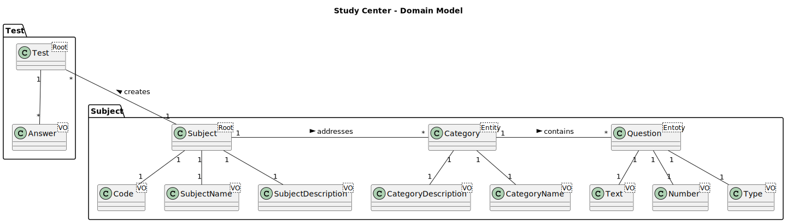
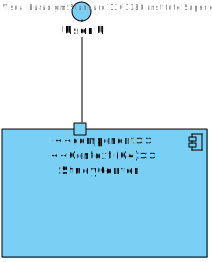
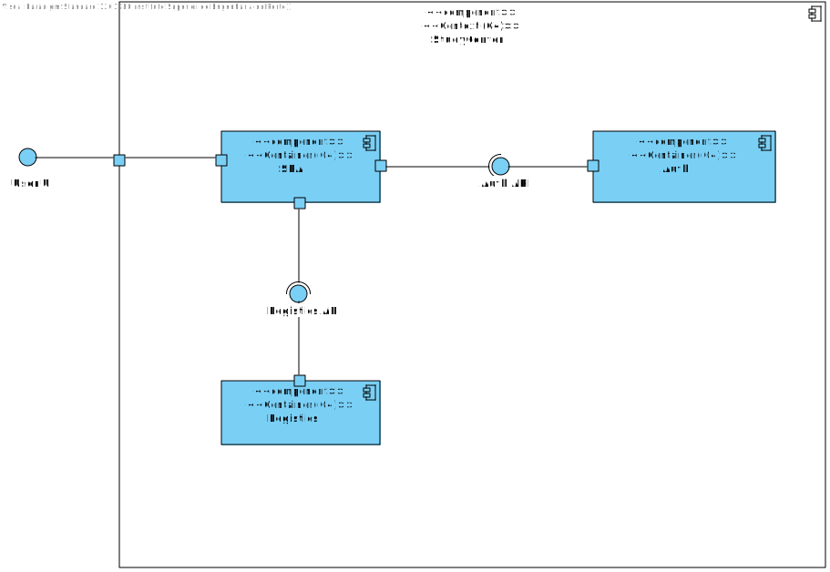
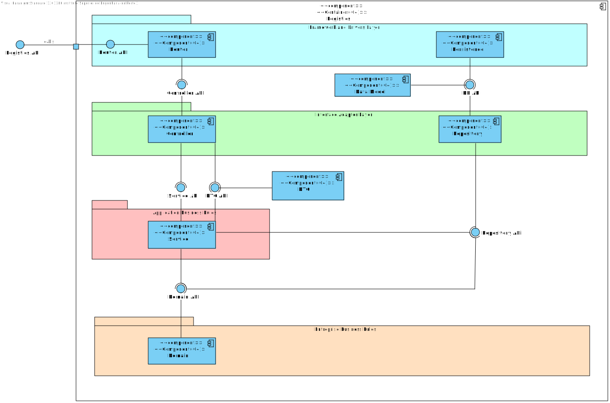

# 0. Index

|              Contents              |
| :--------------------------------: |
| [1. Domain Model](#1-domain-model) |
|   [2. (C4) Level 1](#2-c4-level-1)    |
|   [3. (C4) Level 2](#3-c4-level-2)    |
|   [4. (C4) Level 3](#4-c4-level-3)    |

# 1. Domain Model

---

# 2. (C4) Level 1

## 2.1. Logical View

---

# 3. (C4) Level 2

## 3.1. Logical View

---

# 4. (C4) Level 3

## 4.1 Logical View

